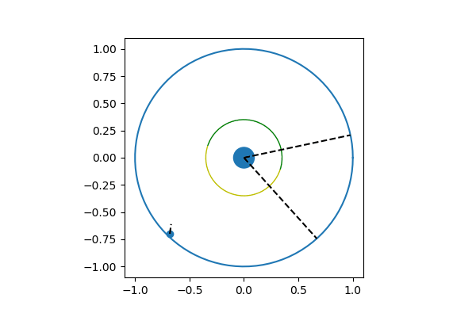

[Owl environment](/baselines_owl): I created an environment where the agent (which you can think of as an owl) needs to turn it's head to track prey. This was an idea I got while reading the book rethinking consciousness. The goal is to give the agent both eyes and ears, with the help of which it can track prey. I think interesting related research questions that we can ask are: "will training an agent to do task optimally this give raise to attention that switches between ears and eyes?".

You can see the code for the baseline in the notebook. DQN works. 

Animation of the trained DQN network:

Still to do:
* Implementing tabularQ on this environment.