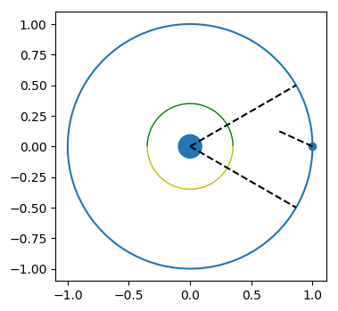

## RL environments

This folder consists of various RL environments that I built. All the environments here are compatible with 

### List of environments:

* [Owl](owl.py): This is an environment where the Owl needs to detect the prey by moving it's head. It has both tabular and normal variants. 

* [FourRooms](fourrooms.py): This is a gridworld environment that allows any wall structure. It has multiple variants: tabular, image, vector, unsupervised. (TODO: change names to files to make things more clear) 

* [FourRoomsDynamic](fourrooms_dynamic.py): This is a dynamic version of the above environment. That is, each time the episode is reset, we have a new wall structure (sampled uniformly from a list of prechosen structures).

* [LineWorld](lineworld.py): This is an linear chain world where the agent starts at the middle and it's goal is to reach the terminal state. Terminal state is the right most state. This can be used to perform sanity checks on algorithms like TabularSR (to do: add link to tabular SR).

* [PixelGridWorld](gridworld_pixel.py) : Environment for image state space of the grid world. This can be used to do sanity checks for agents that work on high dimensional state spaces.