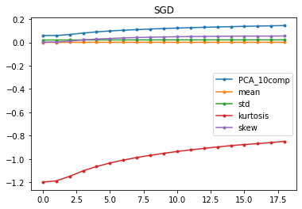
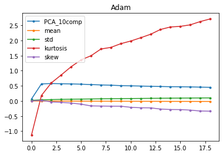

## Estimating learning rule from converged minima

Inspired from discussions at [LiNC lab](http://linclab.org/) and formulated my methodology after skimming through [this paper](https://arxiv.org/abs/2010.11765).

Research question: Can we predict which learning rules the network uses by just seeing the minima it reaches for various parameters initialization of the neural network?

Methodology:
- Creating the dataset:
	- Train 50 networks with the `SGD(lr=0.005, momentum=0.9)` learning rule and 50 with `Adam(lr=0.005)`. Train them for one epoch on MNIST. The network architecture is 784 -> 500 -> 10.
	- Extract the following properties for the first layer weights at convergence: principle components to reach 40% of explained variance, mean, norm, skew, std, kurtosis. This is our dataset use in the next step.
- Train classifiers:
	- Split the dataset into training and testing sets. 
	- Use train sets to train various classifiers to find which learning rule was used (2 class classification problem).
	- **Result:** We observed that we can seperate these networks with 100% accuracy.
- Visualize properties while training:
	- We plot how each of the properties change as the network gets trained for both learning rules.
	- **Finding:**: Even though all of them start at a similar point, the evolution of dynamics is very different for SGD with momentum versus Adam. Hence, it seems like there could be a lot of information about the learning rules that can be extracted from these simple properties.

